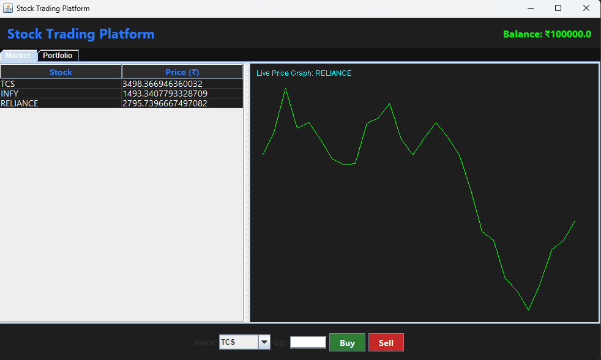
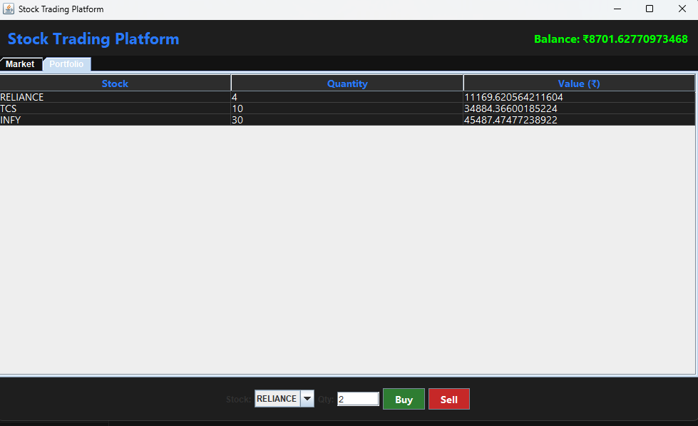

# 📈 Stock Trading Platform (Java Swing Simulation)

A **Java-based Stock Trading Platform** that simulates a real-world trading environment using **Swing GUI**.  
The application allows users to view live-like stock prices, perform buy/sell operations, track portfolio performance, and visualize stock trends using real-time graphs — all without external APIs.

This project is designed for **academic evaluation**, **OOP practice**, and **desktop GUI demonstration**.

---

## 🚀 Features

- 🖥️ **Attractive Swing GUI (Dark Theme)**
- 📊 **Simulated Live Stock Market**
- 🔄 Auto price updates using timer
- 💹 **Buy & Sell Stocks**
- 💼 **Portfolio Tracking**
- 📈 **Real-time Line Graph Visualization**
- 🧠 Object-Oriented Design
- 📴 Fully Offline (No API dependency)
- 🎓 Exam & Viva friendly

---

## 🧩 Problem Statement Coverage

✔ Simulate a basic stock trading environment  
✔ Market data display  
✔ Buy/Sell operations  
✔ Portfolio performance tracking  
✔ OOP-based design  
✔ GUI using Java Swing  
✔ Additional graphical visualization (charts)

---

## 🛠️ Technology Stack

| Category | Technology |
|--------|------------|
| Language | Java (JDK 8+) |
| GUI | Java Swing & AWT |
| Data Structures | ArrayList, HashMap |
| Charts | Custom Swing Graphics (`paintComponent`) |
| Architecture | Object-Oriented Programming |
| External Libraries | ❌ None |

---

## 🖼️ Screenshots

### 🔹 Market View with Live Graph


### 🔹 Portfolio & Trading Panel


> 📌 Images are stored in the `imgs/` directory.

---

## 📂 Project Structure

StockTradingPlatformGUI.java
imgs/
├── img1.png
└── img2.png
README.md

---

## ▶️ How to Run the Project

### 1️⃣ Prerequisites
- Java JDK 8 or above
- Any IDE (IntelliJ / Eclipse / VS Code) or terminal

### 2️⃣ Compile
```bash
javac StockTradingPlatformGUI.java
```
### 3️⃣ Run
```bash
java StockTradingPlatformGUI
```

👨‍💻 Author
Jayesh Patil

---
